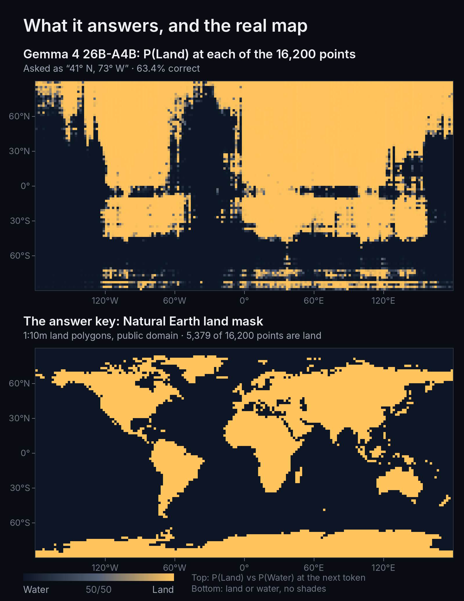
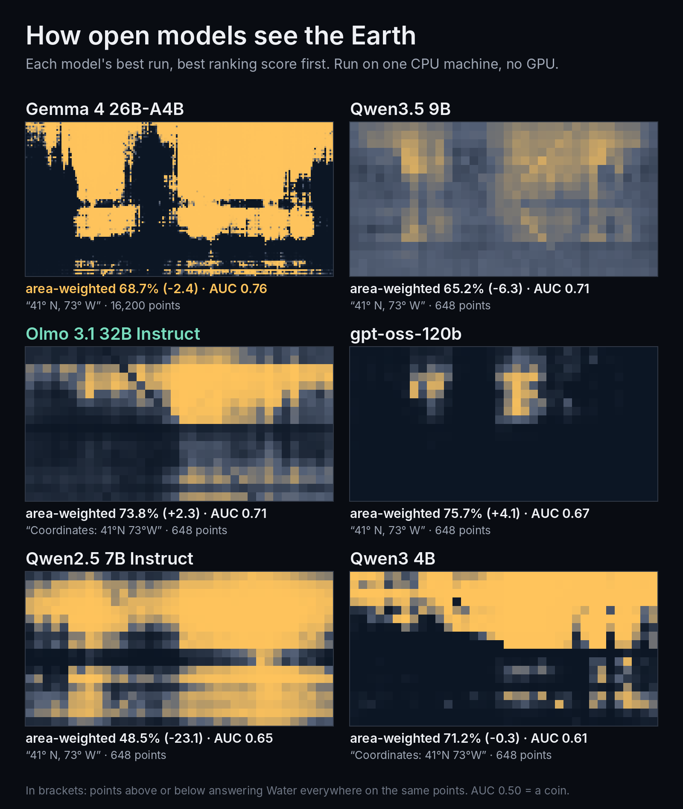
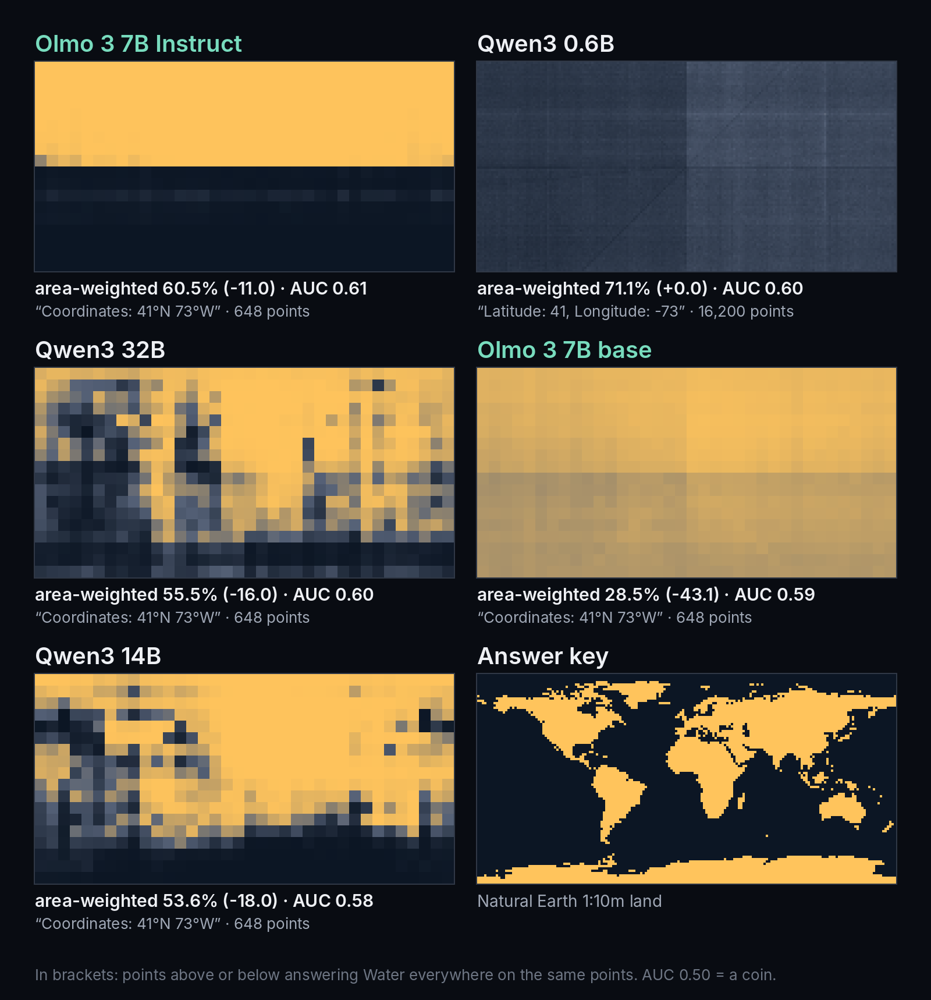
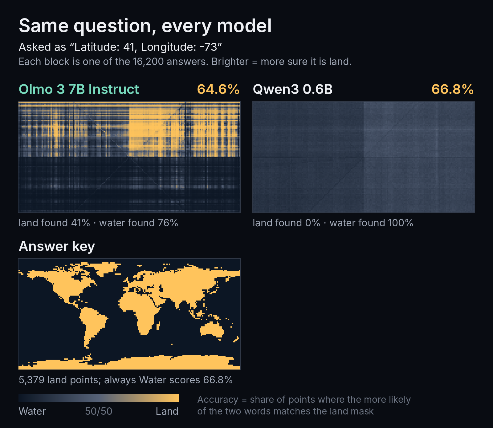
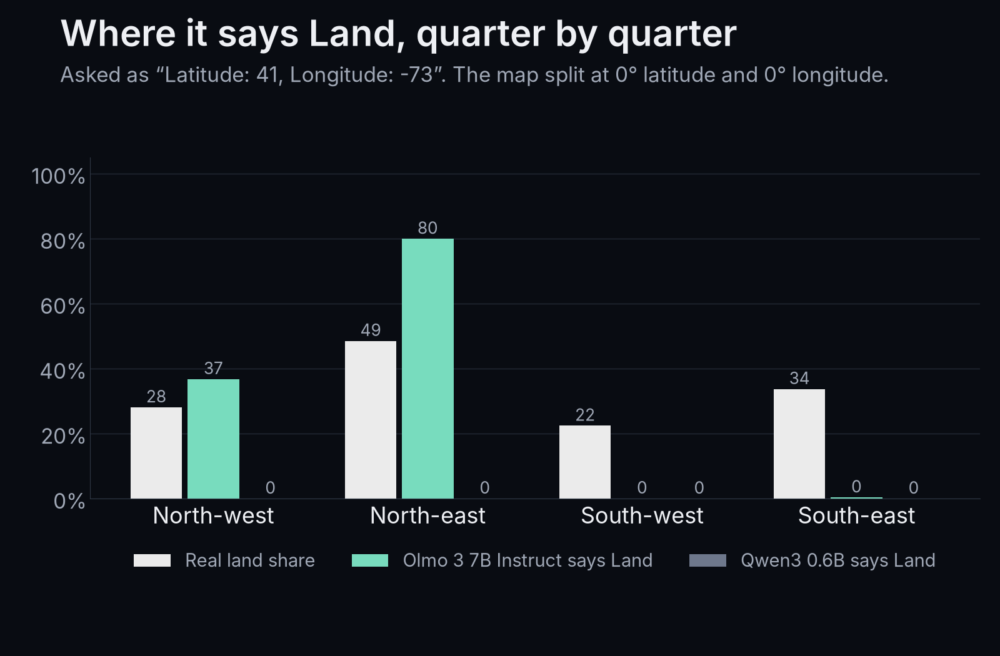
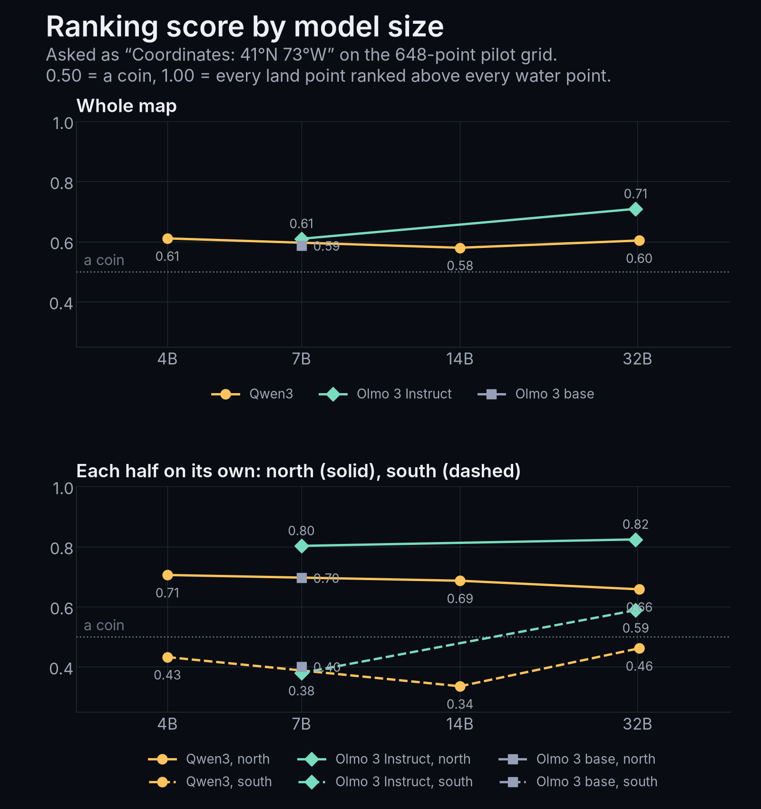

# Land or Water?

[](https://github.com/FavioVazquez/land-or-water/actions/workflows/check.yml) [](https://github.com/FavioVazquez/showtime)

**Karpathy's "Land or Water?" test, on open models you can run yourself.** One CPU box, no GPU, no API keys.

Ask a model *"Land or Water?"* for 16,200 coordinates on a 2-degree grid, plot the answers, and you get the world as the model imagines it. The newest Claude models draw it [almost perfectly](https://x.com/karpathy/status/2105909609487872075). This repo asks the same question to 11 open models, keeps every raw answer, and checks every number against the data.

**[Open the map viewer](https://faviovazquez.github.io/land-or-water/)** · [Watch the video](https://x.com/FavioVaz/status/2106420676731056192) · [Results table](RESULTS.md)



## What we found

- **The clearest map came from Gemma 4 26B-A4B**, on all 16,200 points: crude but real continents. It still scores **68.7%** area-weighted, below the **71.1%** you get by always saying "Water". (AUC 0.755: the best ranking of land over water of any open model here.)
- **A sharp map is still a frontier ability.** The best open model a CPU box can run draws the outline of the world, not its coastline.
- **The question decided more than the model.** Asked `Latitude: 41, Longitude: -73`, small models read the minus sign, not the place.
- **Checking against a published result paid off.** Reproducing [@arithmoquine's write-up](https://outsidetext.substack.com/p/how-does-a-blind-model-see-the-earth) found a better prompt and a real bug (Gemma's missing start-of-text token: AUC 0.67 before the fix, 0.76 after).

## The gallery

Each model's best run, sorted by AUC. In brackets: points above or below answering "Water" everywhere.




## The trap: one minus sign

With the coordinate written as `Latitude: 41, Longitude: -73`, Olmo 3 7B Instruct said "Land" at 80% of the points where both numbers are positive and almost nowhere else. Knowing only which quarter of the map a point falls in explains 71% of the variation in its answers; for the real map, 4%. Qwen3 0.6B said "Water" at 16,199 of 16,200 points.




Bigger didn't fix it: Qwen3 scored AUC 0.61 at 4B, 0.58 at 14B, 0.60 at 32B. Olmo 3.1 32B reached 0.71, and since Ai2 publishes Olmo's training data, you can check it only ever read text.



## How it works

```
for each of 16,200 points (lat 89..-89, lon -179..179, step 2):
    prompt  = model's own chat template( "If this location is over land, say 'Land'. If this location is
              over water, say 'Water'. Do not say anything else. 41° N, 73° W" )
    logits  = one forward pass, empty cache          # llama.cpp, 8-bit weights, CPU
    P(Land) = P("Land") / (P("Land") + P("Water"))    # first answer token, thinking off
score against Natural Earth 1:10m land:
    area-weighted accuracy  (each point weighted by cos(latitude), as on the Claude chart)
    AUC                     (random land point vs random water point: who gets the higher P(Land)?)
```

- Every point is its own prompt with an empty cache: no batching, no prefix reuse. Random points are re-run at the end of every run (40 on the full grid, 10 on the pilot) and matched exactly.
- Each model file is pinned to a Hugging Face commit and checked by sha256 ([`eval/models.json`](eval/models.json)).
- Chat templates are the official ones from each model's repo ([`eval/templates/`](eval/templates/)).
- The always-"Water" floor is printed next to every score. On this grid it is 66.8% plain and 71.1% area-weighted, so a model must beat that to know anything.

## Run it yourself

You need [uv](https://docs.astral.sh/uv/). The first run builds llama.cpp's Python bindings.

```bash
git clone https://github.com/FavioVazquez/land-or-water && cd land-or-water
uv run landwater.py --list                              # the models, with sizes and licences
uv run landwater.py --model qwen3-0.6b --quick          # 648 points, a few minutes on a laptop
uv run landwater.py --model gemma-4-26b-a4b-it          # the full grid with the best prompt (27 GB, ~50 min on 60 threads)
```

Check every number we quote, from the raw CSVs (standard library only, under a second):

```bash
python3 eval/score.py --check
```

GitHub runs that check on every push, so a green badge means the write-up matches the data.

## What's in here

| path | what |
|---|---|
| `runs/full/` | the three 16,200-point runs: one CSV row per point with P(Land), P(Water), the top token and more; `.run.json` has the exact prompt, template hash, CPU, timing and environment |
| `runs/pilot/` | 15 runs on the 648-point grid: three ways of writing the coordinate, the size ladder, the reference prompt |
| `runs/excluded/` | the Gemma run with the missing start-of-text token, kept for the record and never scored as a result |
| `eval/run_eval.py` | the eval: one prompt per point, logits read with llama.cpp |
| `eval/score.py` | scores, the results table and the check of every quoted number |
| `eval/landmask.py` | builds the answer key from Natural Earth 1:10m land |
| `data/` | the answer key per grid point |
| `docs/` | the map viewer (GitHub Pages) |

## Limits

- Not frontier models: the largest here has 117B parameters (about 5B active per answer).
- One token, no reasoning: thinking is off and we read the first answer token. Letting a model reason first might help.
- 8-bit weights (gpt-oss as released, MXFP4); one run per model and format; most comparisons on the 648-point grid.
- The final prompt was chosen after the first one failed. Every format we tried is here.
- Our Qwen2.5 7B run never matched the reference write-up's picture of that model. We don't know why; it stays open.

## The video was made with showtime

The video reply was made by **Claude Opus 5.5** (running in Devin) with **[showtime](https://github.com/FavioVazquez/showtime)**, an open-source video studio for coding agents. Opus built every scene, drew the maps from the raw CSVs and rendered the video on the same CPU box, with no API keys. For a video about data, three things mattered:

- **A claims ledger.** Every number on screen names the result file and field it came from, and is recomputed from the CSVs before every render.
- **No stand-in data in a final.** Previews carried a banner on every frame; the final render refuses to run on placeholder data.
- **A critic that didn't make the video.** A separate review pass found 19 issues before posting; 17 were fixed.

Want your agent to turn its own experiments into videos like this? `npx skills add FavioVazquez/showtime`, or see the [showtime repo](https://github.com/FavioVazquez/showtime).

## Credits

- [@karpathy](https://x.com/karpathy) for the eval, [@celestepoasts](https://x.com/celestepoasts) for the Claude chart, and [@arithmoquine](https://x.com/arithmoquine) for ["How Does A Blind Model See The Earth?"](https://outsidetext.substack.com/p/how-does-a-blind-model-see-the-earth), the method this depends on.
- Answer key: [Natural Earth](https://www.naturalearthdata.com/) 1:10m land v5.1.1, public domain.
- Models run with [llama.cpp](https://github.com/ggml-org/llama.cpp) through llama-cpp-python. Model licences are listed in `eval/models.json` (all Apache-2.0).

Code: MIT. Results and figures: CC BY 4.0.
